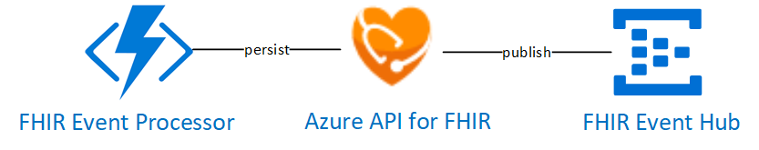

# FHIR Event Processor
# !!!DEPRECATED!!! This functionality has been incorporated into the [FHIR Proxy](https://github.com/microsoft/health-architectures/tree/master/FHIR/FHIRProxy)
# This code is no longer maintained
FHIR Event Processor is an Azure Function App solution that provides the following services for ingesting FHIR Resources into the FHIR Server:
 + Import and process valid HL7 bundles and persist them into a FHIR Compliant store.
 + Provides a secure proxy a connection to a destination FHIR Server without exposing credentials
 + Publish successful FHIR Server CRUD events to an event hub for topic subscribers to use in event driven workflows

# Architecture Overview


## Required Application Settings

The application settings that need to be configured for the hl7ingest function app:
```
FS_URL:<The URL of the Destination FHIR server>
FS_TENANT_NAME:<The AAD tenant name for authenticating to the destination FHIR server
FS_CLIENT_ID: <The service client id for access to the FHIR Server
FS_SECRET: <The service client secret for access to the FHIR Server
FS_RESOURCE: <The OAUTH2 audience for the destination FHIR Server (for API for FHIR it is typically https://azurehealthcareapis.com)
EventHubConnection: <The connection string to the event hub to publish FHIR CRUD events>
EventHubName: <The name of the event hub to publish FHIR CRUD events>
```
## Deploying your own FHIR Event Processor
This function is deployed and Configured as a part of the [HL72FHIR Workflow Platform](https://github.com/microsoft/health-architectures/tree/master/HL7Conversion)

# Contributing

This project welcomes contributions and suggestions.  Most contributions require you to agree to a
Contributor License Agreement (CLA) declaring that you have the right to, and actually do, grant us
the rights to use your contribution. For details, visit https://cla.opensource.microsoft.com.

When you submit a pull request, a CLA bot will automatically determine whether you need to provide
a CLA and decorate the PR appropriately (e.g., status check, comment). Simply follow the instructions
provided by the bot. You will only need to do this once across all repos using our CLA.

This project has adopted the [Microsoft Open Source Code of Conduct](https://opensource.microsoft.com/codeofconduct/).
For more information see the [Code of Conduct FAQ](https://opensource.microsoft.com/codeofconduct/faq/) or
contact [opencode@microsoft.com](mailto:opencode@microsoft.com) with any additional questions or comments.

FHIR® is the registered trademark of HL7 and is used with the permission of HL7.
