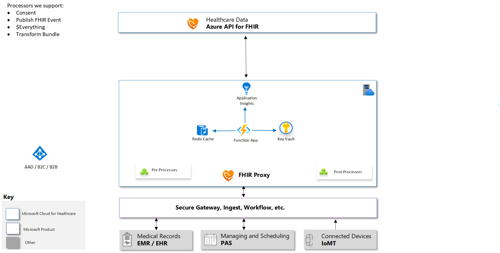

# Secure FHIR Proxy

Secure FHIR Proxy is an Azure Function based solution to act as an intelligent FHIR reverse proxy.
It is integrated with Azure Active Directory (AAD) to provide Role based access control.  This solution contains the following examples:
 + ProxyBase - A generic FHIR Proxy with no business logic validation and only authentication verification. You can use this sample to build your own business purpose driven proxy to perform any pre processing and post processing tasks for FHIR server calls.
 + ParticipantAccess - A sample FHIR Proxy based on ProxyBase that will filter returned patient based resources to only include Patients where you are the patient or are a "Practitioner of Record" (e.g. in a participant role and are part of the patient care team) Note: this only filters patient based resources
 + SecureLink - A administration function that links AAD Principals in roles for the FHIR server with corresponding FHIR Resources to establish a map between AAD Role Identity and FHIR
## Architecture Overview



## Deploying your own FHIR Proxy

Please note you should deploy this proxy into a tenant that you control Application Registrations, Enterprise Applications, Permissions and Role Definitions Assignments

1. [Get or Obtain a valid Azure Subscription](https://azure.microsoft.com/en-us/free/)</br>
   _Note:Skip to Step 5 if you already have a FHIR Server/Service Client deployed_
2. [Deploy an Azure API for FHIR instance](https://docs.microsoft.com/en-us/azure/healthcare-apis/fhir-paas-portal-quickstart)
3. [Register a Service Client to Access the FHIR Server](https://docs.microsoft.com/en-us/azure/healthcare-apis/register-service-azure-ad-client-app).
4. [Find the Object Id for the Service Client and Register it with the FHIR Server](https://docs.microsoft.com/en-us/azure/healthcare-apis/find-identity-object-ids)
5. You will need the following information to configure the Secure FHIR Proxy 
   + Client/Application ID for the FHIR Service Client
   + The Client Secret for the FHIR Service Client
   + The AAD Tenant ID for the FHIR Server/Service Client
   + The Audience/Resource for the FHIR Server/Service Client typically https://azurehealthcareapis.com for Azure API for FHIR
6. [If you are running Windows 10 make sure you have enabled Windows Linux Subsystem](https://code.visualstudio.com/remote-tutorials/wsl/enable-wsl) and [Installed a Linux Distribution](https://code.visualstudio.com/remote-tutorials/wsl/install-linux)
7. [Install Azure CLI 2.0 on Linux based System or Windows Linux Subsystem](https://docs.microsoft.com/en-us/cli/azure/install-azure-cli-apt?view=azure-cli-latest)
8. [Install jq for your environment](https://stedolan.github.io/jq/download/)
9. [Download/Clone this repo](https://github.com/microsoft/health-architectures)
10. Open a bash shell into the Azure CLI 2.0 environment
11. Switch to the FHIR/FHIRproxy subdirectory of this repo ```cd FHIR/FHIRProxy```
12. Run the deployfhirproxy.bash script and follow the prompts
13. Congratulations you now have a Secure FHIR Proxy instance with authentication running. You can now configure Authorized Access.

## Configuring Authorization Access Roles for Users
At a minimum, users must be placed in one or more FHIR Access roles in order to access the FHIR Server. The Access roles are Administrator, Resource Reader and Resource Writer
1. [Login to Azure Portal](https://portal.azure.com) _Note: If you have multiple tenants make sure you switch to the directory that contains the Secure FHIR Proxy_
2. [Access the Azure Active Directory Enterprise Application Blade](https://ms.portal.azure.com/#blade/Microsoft_AAD_IAM/StartboardApplicationsMenuBlade/AllApps/menuId/)
3. Change the Application Type Drop Down to All Applications and click the Apply button
4. Enter the application id from above in the search box to locate the Secure FHIR Proxy application
5. Click on the Secure FHIR Proxy application in the list
6. Click on Users and Groups from the left hand navigation menu
7. Click on the +Add User button
8. Click on the Select Role assignment box
9. Select the access role you want to assign to specific users
   The following are the predefined FHIR Access roles:
   + Administrator - Full Privileges to Read/Write/Link resource to the FHIR Server
   + Resource Reader - Allowed to Read Resources from the FHIR Server
   + Resource Writer - Allowed to Create, Update, Delete Resources on the FHIR Server
  
    When the role is selected click the select button at the bottom of the panel

10. Select the Users assignment box
11. Select and/or Search and Select registered users/guests that you want to assign the selected role too.
12. When all users desired have been selected click the select button at the bottom of the panel.
13. Click the Assign button.
14. Congratulations! The selected users have been assigned the access role and can now perform allowed operations against the FHIR Server

# ProxyBase Endpoint
This endpoint will by default only enforce access roles granted to users/applications. You can GET/POST any FHIR compliant request/query
For example to see the conformance statement for the FHIR Server, use your browser and access the following endpoint:</br>
```https://<secure proxy url from above>/api/fhir/metadata```

_Note: Individual endpoints can be disabled by disabling the corresponding Function in the Secure FHIR Proxy Function App via the Azure Portal_</br>
_Note: You will need to login as a user in a FHIR Reader and/or FHIR Administrative role to view._
 
# Participant Endpoint
This endpoint is a further extended example of the ProxyBase endpoint it will filter returned patient based resources to only include Patients where you are the patient owner of the medical record or are a "Practitioner of Record" (e.g. in a participant role and are part of the patient care team, listed as a practitioner participant in an Encounter resource or a general practitioner for the Patient). The process is depicted in the diagram below:
## How the participant endpoint works


## Configuring Participant Authorization Roles for Users
At a minimum, users must be placed in one or more FHIR Participant roles in order to appropriately filter results from tbe FHIR Server. The Access roles are Patient, Practitioner and RelatedPerson. _Note:The user must also be in an appropriate Access role defined above_
1. [Login to Azure Portal](https://portal.azure.com) _Note: If you have multiple tenants make sure you switch to the directory that contains the Secure FHIR Proxy_
2. [Access the Azure Active Directory Enterprise Application Blade](https://ms.portal.azure.com/#blade/Microsoft_AAD_IAM/StartboardApplicationsMenuBlade/AllApps/menuId/)
3. Change the Application Type Drop Down to All Applications and click the Apply button
4. Enter the application id from above in the search box to locate the Secure FHIR Proxy application
5. Click on the Secure FHIR Proxy application in the list
6. Click on Users and Groups from the left hand navigation menu
7. Click on the +Add User button
8. Click on the Select Role assignment box
9. Select the access role you want to assign to specific users
   The following are the predefined FHIR Access roles:
   + Patient - This user is a patient and is linked to a Patient resource in the FHIR Server
   + Practitioner - This user is a practitioner and is linked to a Practitioner resource in the FHIR Server
   + RelatedPerson - This user is a relative/caregiver to a patient and is linked to a RelatedPerson resource in the FHIR Server
    
   When the role is selected click the select button at the bottom of the panel
10. Select the Users assignment box
11. Select and/or Search and Select registered users/guests that you want to assign the selected role too.
12. When all users desired have been selected click the select button at the bottom of the panel.
13. Click the Assign button.
14. Congratulations! The selected users have been assigned the participant role and can now be linked to FHIR Resources

## Linking Users in Participant Roles to FHIR Resources
1. Make sure you have configured Participant Authorization Roles for users
2. Obtain the FHIR Resource Id you wish to link to a AAD User principal.  Note you can use any search methods for the resources described in the FHIR specification.  It is strongly recommended to use a known Business Identifier in your query to ensure a specific and correct match.
   For example:
   To find a specific Patient in FHIR with a MRN of 1234567 you could issue the following URL in your browser:
   
   ```https://<your fhir proxy url>/api/fhir/Patient?identifier=1234567```
   
   To find a specific Practitioner with last name Smith, in this case you can use other fields to validate like address, identifiers,etc... 
   ```https://<your fhir proxy address>/api/fhir/Practitioner?name=smith```
    
   The resource id is located in the id field of the returned resource or resource member in a search bundle
   ```"id": "3bdaac8f-5c8e-499d-b906-aab31633337d"``` 
 
   _Note: You will need to login as a user in a FHIR Reader and/or FHIR Administrative role to view._
 
 3. You will need to obtain the participant user principal name for the AAD instance in your tenant that are assigned and in roles for the secure proxy application.  Make sure the Role they are in corresponds to the FHIR Resource you are linking. 
    For example: ```somedoctor@sometenant.onmicrosoft.com```
 4. Now you can link the FHIR Resource to the user principal name by entering the following URL in your browser:
 
    ```https://<your fhir proxy url>/api/manage/link/<ResourceName>/<ResourceID>?name=<user principal name>```

    For example to connect Dr. Mickey in my AAD tenant principal whose user name is mickey@myaad.onmicrosoft.com to the FHIR Practitioner Resource Id 3bdaac8f-5c8e-499d-b906-aab31633337d you would enter the following URL:
    ```https://<your fhir proxy url>/api/manage/link/Practitioner/3bdaac8f-5c8e-499d-b906-aab31633337d?name=mickey@myaad.onmicrosoft.com```
     
    _Note: You will need to login as a user in a FHIR Administrative role to perform the assignment_

5.  You are done! The principal user is now connected in role to the FHIR resource.

## Contributing

This project welcomes contributions and suggestions.  Most contributions require you to agree to a
Contributor License Agreement (CLA) declaring that you have the right to, and actually do, grant us
the rights to use your contribution. For details, visit https://cla.opensource.microsoft.com.

When you submit a pull request, a CLA bot will automatically determine whether you need to provide
a CLA and decorate the PR appropriately (e.g., status check, comment). Simply follow the instructions
provided by the bot. You will only need to do this once across all repos using our CLA.

This project has adopted the [Microsoft Open Source Code of Conduct](https://opensource.microsoft.com/codeofconduct/).
For more information see the [Code of Conduct FAQ](https://opensource.microsoft.com/codeofconduct/faq/) or
contact [opencode@microsoft.com](mailto:opencode@microsoft.com) with any additional questions or comments.

FHIR® is the registered trademark of HL7 and is used with the permission of HL7.
