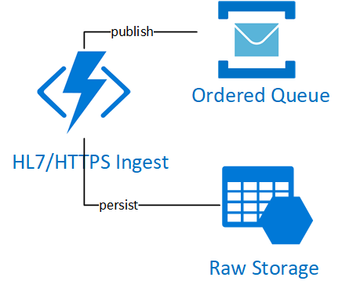

# HL7 Ingest

HL7 Ingest is an Azure Function App solution that provides an HL7 over HTTPS ingest endpoint to accept raw HL7 messages into Azure.  
The HL7 ingest function performs the following actions:
 + Receive the HL7 Message
 + Persist the HL7 Message in the configured storage account
 + Publish a message to configured service bus queue
 + Provide a HL7 ACK/NAK message response to the sender
# Architecture Overview


## Required Application Settings

The application settings that need to be configured for the hl7ingest function app:
```
StorageAccount: <Storage Account Connection String>
StorageAccountBlobContainer: <Storage account hl7 blob container name>
ServiceBusConnection: <Service Bus Connection String>
QueueName: <The name of the destination service bus queue>
```
## Deploying your own HL7 Ingest Function
This function is deployed and Configured as a part of the [HL7 Ingest Platform](www.microsoft.com)

# Contributing

This project welcomes contributions and suggestions.  Most contributions require you to agree to a
Contributor License Agreement (CLA) declaring that you have the right to, and actually do, grant us
the rights to use your contribution. For details, visit https://cla.opensource.microsoft.com.

When you submit a pull request, a CLA bot will automatically determine whether you need to provide
a CLA and decorate the PR appropriately (e.g., status check, comment). Simply follow the instructions
provided by the bot. You will only need to do this once across all repos using our CLA.

This project has adopted the [Microsoft Open Source Code of Conduct](https://opensource.microsoft.com/codeofconduct/).
For more information see the [Code of Conduct FAQ](https://opensource.microsoft.com/codeofconduct/faq/) or
contact [opencode@microsoft.com](mailto:opencode@microsoft.com) with any additional questions or comments.

FHIR® is the registered trademark of HL7 and is used with the permission of HL7.
