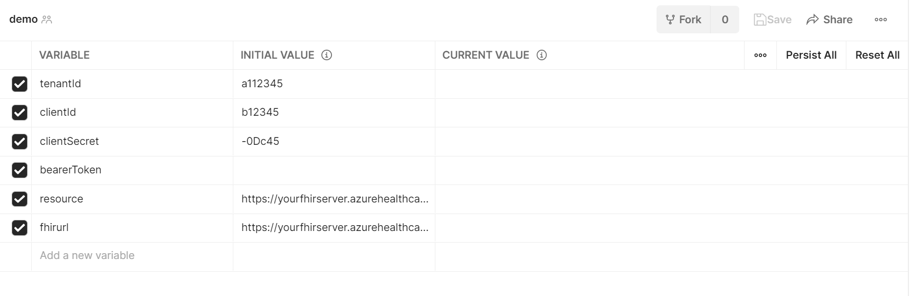
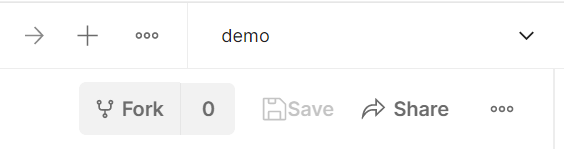
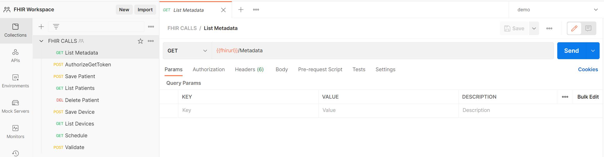
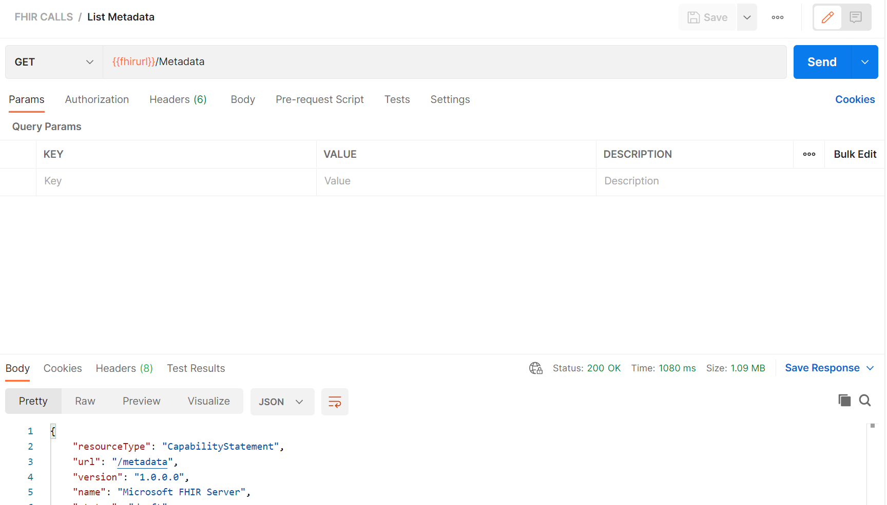
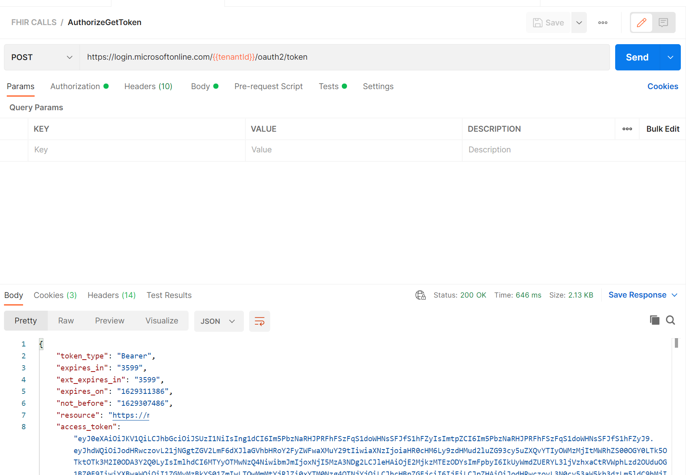

# Sample Postman Environments and Collections 


## Overview 
A client application can access the Azure API for FHIR through a REST API. To send requests, view responses, and debug your application as it is being built, use an API testing tool of your choice. This repo provides examples and samples necessary for accessing the Azure FHIR server using [Postman](https://www.postman.com/).

A Tutorial with Postman is available on [docs.microsoft.com](https://docs.microsoft.com/en-us/azure/healthcare-apis/azure-api-for-fhir/access-fhir-postman-tutorial)

These environments and collections are designed to work with and have been tested with Postman v8 (online and desktop client).


### Prerequisites
A FHIR endpoint in Azure.  To deploy the Azure API for FHIR (a managed service), you can use the [Azure portal](https://docs.microsoft.com/en-us/azure/healthcare-apis/azure-api-for-fhir/fhir-paas-portal-quickstart), [PowerShell](https://docs.microsoft.com/en-us/azure/healthcare-apis/azure-api-for-fhir/fhir-paas-powershell-quickstart), or [Azure CLI](https://docs.microsoft.com/en-us/azure/healthcare-apis/azure-api-for-fhir/fhir-paas-cli-quickstart).

A registered [client application](https://docs.microsoft.com/en-us/azure/healthcare-apis/azure-api-for-fhir/register-confidential-azure-ad-client-app) to access the FHIR service.

__NOTES__ 
- Recommendation is to use either a Service Client or Confidential Client application
- Ensure your client application has a registered reply URL of https://www.getpostman.com/oauth2/callback

You have granted permissions to the client application and your user account, for example, "FHIR Data Contributor", to access the FHIR service. For more information, see [Configure Azure RBAC for FHIR](https://docs.microsoft.com/en-us/azure/healthcare-apis/azure-api-for-fhir/configure-azure-rbac).


## Auth - AAD and Tokens 
The FHIR service is secured by Azure AD. The default authentication can't be disabled. To access the FHIR service, you must get an Azure AD access token first. For more information, see [Microsoft identity platform access tokens](https://docs.microsoft.com/en-us/azure/active-directory/develop/access-tokens).

The POST request AuthorizeGetToken has the following:

URL: https://login.microsoftonline.com/{{tenantid}}/oauth2/token

Body tab set to x-www-form-urlencoded and key value pairs:
- grant_type: Client_Credentials
- client_id: {{clientid}}
- client_secret: {{clientsecret}}
- resource: {{fhirurl}}

Test to set the bearerToken variable
```json
var jsonData = JSON.parse(responseBody);
postman.setEnvironmentVariable("bearerToken", jsonData.access_token);
```
On clicking Send you should see a response with the Azure AD access token, which is saved to the variable accessToken automatically. You can then use it in all FHIR service API requests.

See [FHIR-CALLS](./docs/fhirCalls.md) for additional information avaliable in this Postman collection. 

 
## API for FHIR access
To access the FHIR service, we'll need to create or update the following variables.

- fhirurl – The FHIR service full URL. For example, https://xxx.azurehealthcareapis.com. It's located from the FHIR service overview menu option.
- bearerToken – The variable to store the Azure Active Directory (Azure AD) access token in the script. Leave it blank.
- FHIR server URL, for example, https://MYACCOUNT.azurehealthcareapis.com
- Identity provider Authority for your FHIR server, for example, https://login.microsoftonline.com/{TENANT-ID}
- Audience that is usually the URL of the FHIR server, for example, https://<FHIR-SERVER-NAME>.azurehealthcareapis.com or https://azurehealthcareapis.com.
- client_id or application ID of the confidential client application used for accessing the FHIR service.
- client_secret or application secret of the confidential client application.

Postman Env variable | Azure Setting          | Variable Type 
---------------------|------------------------|--------------
tenantId             | Azure AD Tenant ID     | GUID 
clientId             | Azure AD Client ID     | GUID
clientSecret         | Azure AD Client Secret | Secret 
bearerToken          | Auto-Populated         | Token
fhirurl              | FHIR Endpoint          | URL
resource             | FHIR Endpoint          | URL


## API for FHIR access via Microsoft FHIR-Proxy 
Creating Postman collections for [Microsoft's FHIR-Proxy](https://github.com/microsoft/fhir-proxy) and its various components can be daunting when starting from nothing.  The fhir-proxy directory in this repo contains a sample Postman Environment to help users get started. 

the 

__NOTE__ All FHIR-Proxy Postman congiruations can be found in the Keyvault installed during setup 

Postman Env variable | Azure Setting          | Variable Type 
---------------------|------------------------|--------------
tenantId             | Azure AD Tenant ID     | GUID 
clientId             | Azure AD Client ID     | GUID
clientSecret         | Azure AD Client Secret | Secret 
bearerToken          | Auto-Populated         | Token
fhirurl              | FHIR Endpoint          | URL
resource             | FHIR Endpoint          | URL


## Testing Setup 
Testing the setup begins simply by adding values to the Environment variables.

1) Download the sampes environments in either [API-FHIR](https://github.com/daemel/fhir-postman/tree/main/api-for-fhir) or [FHIR-Proxy](https://github.com/daemel/fhir-postman/tree/main/fhir-proxy)   

2) Open Postman (web or client), Import the Environment (ie api-for-fhir-postman_environment.json) and the Collections (FHIR-CALLS.postman_collection.json)

3) Go to Environments, select the Environment (api-fhir or fhir-proxy) and enter in the variable information (skip the bearer token) from your Client Application and the FHIR Service

The completed Environment should look something like this

Environment variables 

Remember to set your "active" environment before going to the next step 

4) Go to Collections, select the FHIR Calls collection to open it then select List Metadata, it should look like this example 

FHIR Calls 

5) Click Send (see above) to test the FHIR URL setup and the basic functions of your FHIR Service.  This command does not use Auth (by design) and it returns your FHIR Service Capability Statement. 

FHIR Calls 

6) Next Select AuthorizeGetToken.  Note there are values in the call tabs, Authorization, Headers, Body and Tests.  In short this call will call the Azure AD Tenant with your ClientID, ClientSecret and Resource in the Body to obtain a Token.  On receipt of that Token, it is parsed into the bearerToken value.  The result should look like this 

FHIR Calls 

The rest of the Calls use the Token from the step above to Authenticate requests to the FHIR Service.  

## Resources 

[Access the FHIR service using Postman tutorial](https://docs.microsoft.com/en-us/azure/healthcare-apis/use-postman)

 
## FAQ's / Issues 

403 - Unauthorized:  Check the Azure RBAC for FHIR service [link](https://docs.microsoft.com/en-us/azure/healthcare-apis/fhir/configure-azure-rbac-for-fhir)

  
