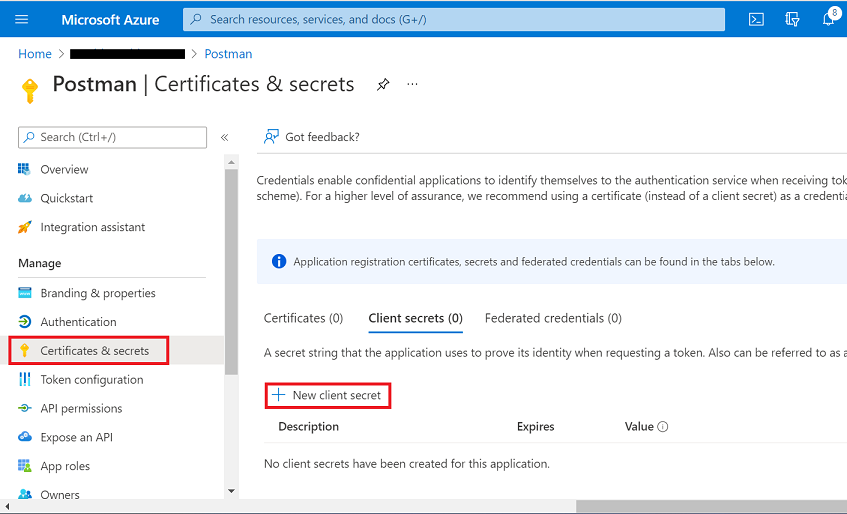
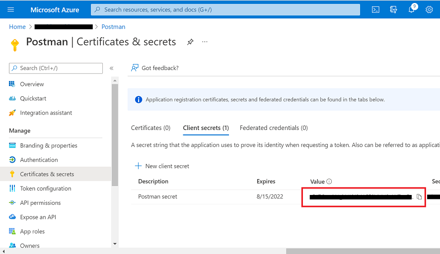
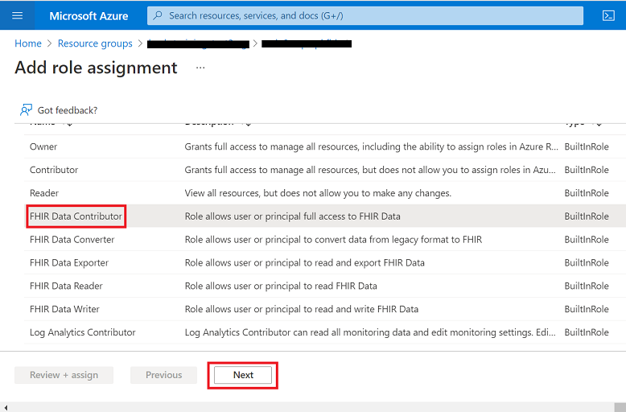
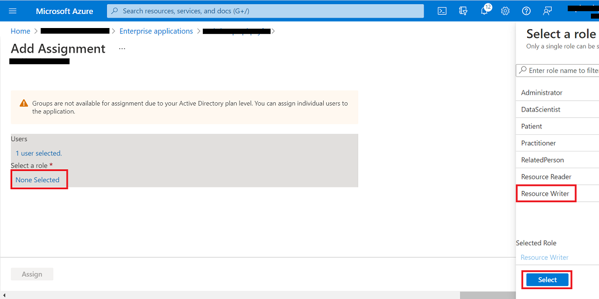

# Postman Setup + sample Postman environments and collections 

## Overview 
When testing data connectivity between [Azure API for FHIR](https://docs.microsoft.com/en-us/azure/healthcare-apis/azure-api-for-fhir/overview) and a client app, it is useful to have an API testing utility to send requests, view responses, and debug issues. One of the most popular API testing tools is [Postman](https://www.postman.com/), and in this guide we provide instructions and a basic set of data files to help you get started using Postman to test Azure API for FHIR.

## Prerequisites
+ [Contributor](https://docs.microsoft.com/en-us/azure/role-based-access-control/built-in-roles) role in your Azure Subscription
+ [Application Administrator](https://docs.microsoft.com/en-us/azure/active-directory/roles/permissions-reference#all-roles) role in your Azure Active Directory (AAD) tenant
+ An **Azure API for FHIR endpoint**. To deploy Azure API for FHIR (PaaS), you can use the [Azure portal](https://docs.microsoft.com/en-us/azure/healthcare-apis/azure-api-for-fhir/fhir-paas-portal-quickstart), [PowerShell](https://docs.microsoft.com/en-us/azure/healthcare-apis/azure-api-for-fhir/fhir-paas-powershell-quickstart), or [Azure CLI](https://docs.microsoft.com/en-us/azure/healthcare-apis/azure-api-for-fhir/fhir-paas-cli-quickstart).
+ **FHIR-Proxy** deployed along with Azure API for FHIR. To learn more about FHIR-Proxy (OSS), please visit [here](https://github.com/microsoft/fhir-proxy).
+ **Postman** installed - desktop or web client. See [here](https://www.getpostman.com/) for information about how to install Postman. 

## Getting started
To set up Postman for testing Azure API for FHIR, we'll walk through these steps:

**Step 1:** Create an App Registration for Postman in AAD  
**Step 2:** Assign app roles to Postman for Azure API for FHIR and FHIR-Proxy  
**Step 3:** Import environment templates and collection files into Postman  
**Step 4:** Enter parameter values for two Postman environments: 
1. One environment for making API calls directly to Azure API for FHIR  
2. Another environment for making API calls via FHIR-Proxy to Azure API for FHIR 

**Step 5:** Get an authorization token from AAD  
**Step 6:** Test Postman setup and get Azure API for FHIR capabilities statement

## Step 1 - Create an App Registration for Postman in AAD 

Before you can use Postman to make API calls to Azure API for FHIR, you will need to create a registered [client application](https://docs.microsoft.com/en-us/azure/healthcare-apis/azure-api-for-fhir/register-confidential-azure-ad-client-app) to represent Postman in Azure Active Directory.

1. In Azure Portal, go to **Azure Active Directory** -> **App registrations** and click **New registration**. 


2. Type in a name for your Postman application registration in the **Name** field. 


3. Scroll down, and under **Redirect URI (optional)** select **Web** and then enter https://www.getpostman.com/oauth2/callback. Click **Register**. 
 

4. Then, click on your newly created App Registration and you will be taken to the **Overview** blade.  
  

5. Click on **API Permissions** and then click on **+Add a permission**.  


6. Select the **My APIs** tab and then click on the FHIR-Proxy instance that you deployed. 


7. Under **Request API permissions**, click on **Delegated permissions**. 


8. Scroll down and select **user_impersonation** and click **Add permissions**. 


9. Make sure to click **Grant admin consent** (blue checkmark). 
  
  

10. When back in the **API permissions** blade for your Postman app registration, click on **+Add a permission** (again). 
11. Repeat #6. 

12. Under **Request API permissions**, click on the **Application permissions** box on the right. 


13. Select **Resource Reader** and **Resource Writer**. Click **Add permissions**. 


14. Make sure to click **Grant admin consent** again (blue checkmark).


15. When back in the **API permissions** blade for your Postman app registration, click **+Add a permission** (again). 

16. Under **Request API permissions**, select the **APIs my organization uses** tab. Type in "Azure Healthcare APIs" and select the item in the list. 


17. Scroll down and select **user_impersonation** and click **Add permissions**. 


18. Make sure to click **Grant admin consent** again (blue checkmark). 

19. Now click on **Certificates and secrets**. Click **+ New client secret**. 


20. Under **Add a client secret**, enter a name for the secret in the **Description** field. Click **Add**. 


21. Copy the secret **Value** and securely store it somewhere (you will need this when you configure your Postman environment). 


For more information on registering client applications in AAD, please review the [Service Client](https://docs.microsoft.com/en-us/azure/healthcare-apis/azure-api-for-fhir/register-service-azure-ad-client-app) and [Confidential Client](https://docs.microsoft.com/en-us/azure/healthcare-apis/azure-api-for-fhir/register-confidential-azure-ad-client-app) documentation for Azure API for FHIR. 

## Step 2 - Assign user/app roles for Postman in Azure API for FHIR and FHIR-Proxy

1. In Azure Portal, go to **Home** -> **Resource groups** and find the resource group containing your Azure API for FHIR instance. Go to the resource group and click on your Azure API for FHIR app name in the list. 


2. Go to the **Access Control (IAM)** blade. Click on the **Roles** tab.


3. Click on **+Add** -> **Add role assignment**. 


4. In **Add role assignment** under the **Role** tab, scroll down in the list and select **FHIR Data Contributor**. Then click **Next**. 


5. Under the **Members** tab, click on **+Select members**. Type in the name of your Postman app registration in the **Select** field on the right. Highlight your Postman registration, and click **Select**. Then click **Next**. 


6. Under the **Review + assign** tab, click **Review + assign**. 


7. When back in the **Access Control (IAM)** blade, click **+ Add** -> **Add role assignment** (again). 


8. In **Add role assignment** under the **Role** tab, select **FHIR Data Contributor** (again) and click **Next**. 


9. Under the **Members** tab, click on **+Select members**. Type in your name or username in the **Select** field on the right. Highlight your name, click **Select**, and then click **Next**. 


10. Under the **Review + assign** tab, click **Review + assign**. 


11. Now go to **Azure Active Directory** -> **Enterprise applications**. Search for your FHIR-Proxy function app name, and click on it in the list. It might be easiest to search by the **Created on** date. 


12. You will be taken to the FHIR-Proxy **Overview** blade in Enterprise Applications. Click on **Users and groups**. 


13. Click on **+Add user/group**. 


14. In **Add Assignment**, on the left under **Users**, click on **None Selected**. Then under **Users** on the right side, type in your name or username in the search field, click on it, and then click **Select**. 


15. In **Add Assignment**, click on **None Selected** under **Select a role**. On the right side, click on **Resource Writer** and then click **Select**. 


16. Back in **Add Assignment**, click on **Assign**. 


For more information on assigning user/app roles, see [Configure Azure RBAC for FHIR](https://docs.microsoft.com/en-us/azure/healthcare-apis/azure-api-for-fhir/configure-azure-rbac).

## Step 3 - Import environment and collection files into Postman

1. Access the Postman environment template for Azure API for FHIR [here](./api-for-fhir/api-for-fhir.postman_environment.json). Save the file locally.

2. Access the Postman environment template for FHIR-Proxy [here](./fhir-proxy/fhir-proxy.postman_environment.json). Save the file locally.

3. In Postman, create a new Workspace (or select an existing one if already created).

4. Click the ```Import``` button next to the workspace name. 


5. Import the ```api-for-fhir.postman_environment.json``` file that you just saved locally.
    + Add the file to Postman using the ```Upload Files``` button. Then click `Import`. 


6. Import the ```fhir-proxy.postman_environment.json``` file that you just saved locally.
    + Add the file to Postman using the ```Upload Files``` button. Then click `Import`. 


7. Access the ```FHIR-CALLS.postman-collection.json``` file available in this repo [here](./api-for-fhir/FHIR-CALLS.postman_collection.json) and save the file locally. Then import the file into Postman.
    + Add the file to Postman using the ```Upload Files``` button. Then click `Import`. 


8. Access the ```FHIR_Search.postman_collection.json``` file available in this repo [here](./api-for-fhir/FHIR_Search.postman_collection.json) and save the file locally. Then import the file into Postman.
    + Add the file to Postman using the ```Upload Files``` button. Then click `Import`. 


 
## Step 4 - Configure Postman environments
Now you will configure your two Postman environments (`api-fhir` and `fhir-proxy`). 

1. For the `api-fhir` Postman environment, you will need to retrieve the following values: 

- `tenantId` - AAD tenant ID 
- `clientId` - Application (client) ID for Postman service client (go to **AAD** -> **App registrations** -> **Name** -> **Overview**) 
- `clientSecret` - Client secret stored for Postman (see Step 1 #29 above) 
- `fhirurl` - Azure API for FHIR endpoint - e.g. https://<azure_api_for_fhir_app_name>.azurehealthcareapis.com (go to **Resource Group** -> **Overview** -> **Name** -> **FHIR metadata endpoint** and copy *without* "/metadata" on the end)
- `resource` - Azure API for FHIR endpoint - e.g. https://<azure_api_for_fhir_app_name>.azurehealthcareapis.com (same as above)

Populate the above parameter values in your `api-fhir` Postman environment. Leave `bearerToken` blank. Make sure to click `Save` to retain the `api-fhir` environment values.  


2. For the `fhir-proxy` Postman environment, you will need to retrieve the following values: 

- `tenantId` - AAD tenant ID (same as above) 
- `clientId` - Application (client) ID for Postman service client (same as above) 
- `clientSecret` - Client secret stored for Postman (same as above) 
- `fhirurl` - FHIR-Proxy endpoint appended with `/fhir` - e.g. https://<fhir_proxy_app_name>.azurehealthcareapis.com/fhir (go to **Resource Group** -> **Overview** -> **Name** -> **URL**; make sure to append `/fhir` on the end when adding to Postman)
- `resource` - Application (client) ID in the AAD service client for FHIR-Proxy (go to **AAD** -> **App registrations** -> **Name** -> **Overview**)

Populate the above parameter values in your `fhir-proxy` Postman environment. Leave `bearerToken` blank. Make sure to click `Save` to retain the `fhir-proxy` environment values.  


## Step 5 - Get an access token from AAD
In order to connect with Azure API for FHIR, you will need to get an access token from AAD. To obtain an access token via Postman, you can send a ```POST AuthorizeGetToken``` request. The ```POST AuthorizeGetToken``` call is already configured as part of the FHIR CALLS collection that you just imported into Postman (see below).  

__Important:__ Be sure to make one of the environments active (`api-fhir` or `fhir-proxy`) by selecting from the dropdown menu above the `Send` button. In the image below, `fhir-proxy` is shown as the active environment.


On clicking ```Send```, you should receive a response in the **Body** tab like shown below. The access token is automatically saved to the ```bearerToken``` variable in the Postman environment. 

```
{
    "token_type": "Bearer",
    "expires_in": "3599",
    "ext_expires_in": "3599",
    "expires_on": "XXXXXXXXXX",
    "not_before": "XXXXXXXXXX",
    "resource": "XXXXXXX-XXXX-XXXX-XXXX-XXXXXXXXXXXX",
    "access_token": "XXXXXXXXXXXX..."
}
```

You can now use the token in subsequent API calls to Azure API for FHIR - either passing through FHIR-Proxy (with the `fhir-proxy` environment active in Postman) or directly into Azure API for FHIR (with the `api-fhir` environment active in Postman). For more information about access tokens in AAD, see [Microsoft identity platform access tokens](https://docs.microsoft.com/en-us/azure/active-directory/develop/access-tokens).

__Note:__ Access tokens expire after 60 minutes. To obtain a token refresh, simply make another ```POST AuthorizeGetToken``` call and you will receive a new token valid for another 60 minutes.

## Step 6 - Test Postman setup and get Azure API for FHIR capabilities statement 

1) In Postman, click on `Collections` on the left, select the `FHIR Calls` collection and then select `List Metadata`. It should look like this example: 

FHIR Calls 

2) Click `Send` to test the FHIR URL setup and the basic functions of your Azure API for FHIR. This command does not use Auth (by design) and it returns your FHIR Service Capability Statement. 

FHIR Calls 

### Resources 

A tutorial for using Postman with Azure API for FHIR is available on [docs.microsoft.com](https://docs.microsoft.com/en-us/azure/healthcare-apis/azure-api-for-fhir/access-fhir-postman-tutorial).
 
### FAQ's / Issues 

403 - Unauthorized:  Check the Azure RBAC for FHIR service [link](https://docs.microsoft.com/en-us/azure/healthcare-apis/fhir/configure-azure-rbac-for-fhir)

  
