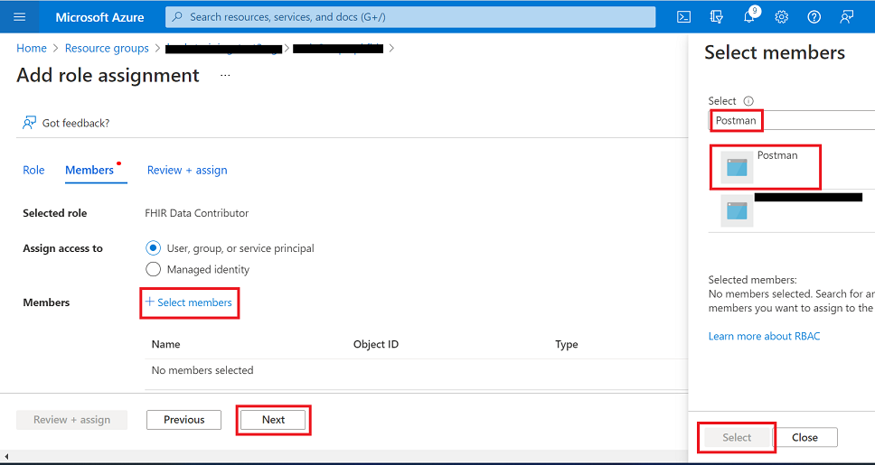
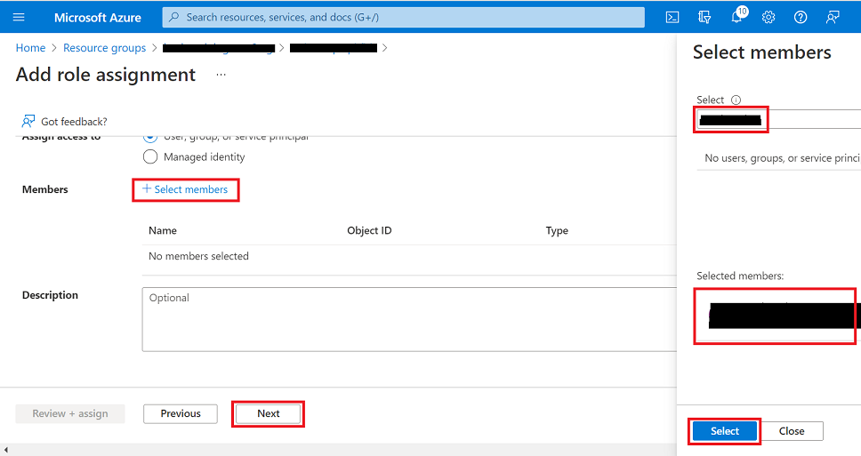
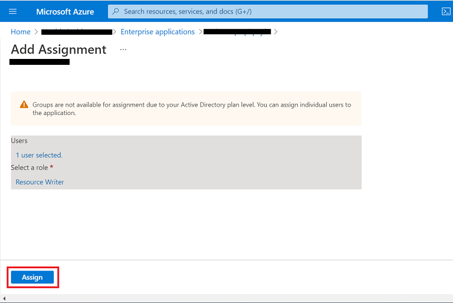

# Postman Setup + sample Postman environments and collections 

## Overview 
When testing data connectivity between [Azure API for FHIR](https://docs.microsoft.com/en-us/azure/healthcare-apis/azure-api-for-fhir/overview) and a client app, it is useful to have an API testing utility to send requests, view responses, and debug issues. One of the most popular API testing tools is [Postman](https://www.postman.com/), and in this guide we provide instructions and a basic set of data files to help you get started using Postman to test Azure API for FHIR.

## Prerequisites
+ An **Azure API for FHIR endpoint**. To deploy Azure API for FHIR (PaaS), you can use the [Azure portal](https://docs.microsoft.com/en-us/azure/healthcare-apis/azure-api-for-fhir/fhir-paas-portal-quickstart), [PowerShell](https://docs.microsoft.com/en-us/azure/healthcare-apis/azure-api-for-fhir/fhir-paas-powershell-quickstart), or [Azure CLI](https://docs.microsoft.com/en-us/azure/healthcare-apis/azure-api-for-fhir/fhir-paas-cli-quickstart).
+ **FHIR-Proxy** deployed along with Azure API for FHIR. To learn more about FHIR-Proxy (OSS), please visit [here](https://github.com/microsoft/fhir-proxy).
+ **Postman** installed - desktop or web client. See [here](https://www.getpostman.com/) for information about how to install Postman. 

## Getting started
To set up Postman for testing Azure API for FHIR, we'll walk through these steps:

**Step 1:** Create an App Registration for Postman in AAD  
**Step 2:** Assign app roles to Postman for Azure API for FHIR and FHIR-Proxy  
**Step 3:** Import environment templates and collection files into Postman  
**Step 4:** Enter parameter values for two Postman environments: 
1. One environment for making API calls directly to Azure API for FHIR  
2. Another environment for making API calls via FHIR-Proxy to Azure API for FHIR 

**Step 5:** Get an authorization token from AAD  
**Step 6:** Test Postman setup and practice making API calls to Azure API for FHIR

## Step 1 - Create an App Registration for Postman in AAD 

Before you can use Postman to make API calls to Azure API for FHIR, you will need to create a registered [client application](https://docs.microsoft.com/en-us/azure/healthcare-apis/azure-api-for-fhir/register-confidential-azure-ad-client-app) to represent Postman in Azure Active Directory.

1. In Azure Portal, go to **Azure Active Directory** -> **App registrations** and click **New registration**. 


2. Type in a name for your Postman application registration in the **Name** field. 


3. Scroll down, and under **Redirect URI (optional)** select **Web** and then enter https://www.getpostman.com/oauth2/callback. Click **Register**. 
 

4. Then, click on your newly created App Registration and you will be taken to the **Overview** blade.  
  

5. Click on **API Permissions** and then click on **Add a permission**.  


6. Select the **My APIs** tab and then click on the FHIR-Proxy instance that you deployed. 


7. Under **Request API permissions**, click on **Delegated permissions**. 


8. Scroll down and select **user_impersonation** and click **Add permissions**. 


9. Make sure to click **Grant admin consent** (blue checkmark). 
  
  

10. When back in the **API permissions** blade for your Postman app registration, click on **Add a permission** (again). 
11. Repeat #6. 

12. Under **Request API permissions**, click on the **Application permissions** box on the right. 


13. Select **Resource Reader** and **Resource Writer**. Click **Add permissions**. 


14. Make sure to click **Grant admin consent** again (blue checkmark).


15. When back in the **API permissions** blade for your Postman app registration, click **Add a permission** (again). 

16. Under **Request API permissions**, select the **APIs my organization uses** tab. Type in "Azure Healthcare APIs" and select the item in the list. 


17. Scroll down and select **user_impersonation** and click **Add permissions**. 


18. Make sure to click **Grant admin consent** again (blue checkmark). 

19. Now click on **Certificates and secrets**. Click **New client secret**. 


20. Under **Add a client secret**, enter a name for the secret in the **Description** field. Click **Add**. 


21. Copy the secret **Value** and securely store it somewhere (you will need this when you configure your Postman environment). 


For more information on registering client applications in AAD, please review the [Service Client](https://docs.microsoft.com/en-us/azure/healthcare-apis/azure-api-for-fhir/register-service-azure-ad-client-app) and [Confidential Client](https://docs.microsoft.com/en-us/azure/healthcare-apis/azure-api-for-fhir/register-confidential-azure-ad-client-app) documentation for Azure API for FHIR. 

## Step 2 - Assign user/app roles for Postman in Azure API for FHIR and FHIR-Proxy

1. In Azure Portal, go to **Home** -> **Resource groups** and find the resource group containing your Azure API for FHIR instance. Click on your Azure API for FHIR instance. 


2. Go to the **Access Control (IAM)** blade. Click on the **Roles** tab.


3. Click on **+ Add** -> **Add role assignment**. 


4. In **Add role assignment** under the **Role** tab, scroll down in the list and select **FHIR Data Contributor**. Then click **Next**. 


5. Under the **Members** tab, click on **+ Select members**. Type in the name of your Postman app registration in the **Select** field on the right. Highlight your Postman registration, and click **Select**. Then click **Next**. 


6. Under the **Review + assign** tab, click **Review + assign**. 


7. When back in the **Access Control (IAM)** blade, under the **Roles** tab select **FHIR Data Contributor** (again) and then click **+ Add** -> **Add role assignment** (again). 


8. In **Add role assignment** under the **Role** tab, select **FHIR Data Contributor** and click **Next**. 


9. Under the **Members** tab, click on **+ Select members**. Type in your name or username in the **Select** field on the right. Highlight your name, click **Select**, and then click **Next**. 


10. Under the **Review + assign** tab, click **Review + assign**. 


11. Now go to **Azure Active Directory** -> **Enterprise applications**. Search for your FHIR-Proxy function app name in the list and click on it. It might be easiest to search by the **Created on** date. 


12. You will be taken to the **Overview** blade for your FHIR-Proxy Enterprise Application. Click on **Users and groups**. 


13. Click on **+Add user/group**. 


14. In **Add Assignment** under **Users**, click on **None Selected**. Under **Users** on the right side, type in your name or username in the search field, click on it, and then click **Select**. 


15. In **Add Assignment**, click on **None Selected** under **Select a role**. Under **Select a role** on the right side, click on **Resource Writer** and then click **Select**. 


16. Under **Add Assignment**, click on **Assign**. 


For more information on assigning user/app roles, see [Configure Azure RBAC for FHIR](https://docs.microsoft.com/en-us/azure/healthcare-apis/azure-api-for-fhir/configure-azure-rbac).

## Step 3 - Import environment and collection files into Postman

1. Access the Postman environment template for Azure API for FHIR [here](./api-for-fhir/api-for-fhir.postman_environment.json). Save the file in your local environment.

2. Access the Postman environment template for FHIR-Proxy [here](./fhir-proxy/fhir-proxy.postman_environment.json). Save the file in your local environment.

3. Create a new Postman Workspace (or select an existing one if already created).

4. Click the ```Import``` button next to your workspace name. 

5. Import the ```api-for-fhir.postman_environment.json``` file that you saved to your local environment.
    + Add the file to Postman using the ```Upload Files``` button or paste in the contents of the file using the ```Raw text``` tab.

6. Import the ```fhir-proxy.postman_environment.json``` file that you saved to your local environment.
    + Add the file to Postman using the ```Upload Files``` button or paste in the contents of the file using the ```Raw text``` tab.

7. Access the ```FHIR-CALLS.postman-collection.json``` file available in this repo [here](./api-for-fhir/FHIR-CALLS.postman_collection.json) and save the file to your local environment. Then import the file into Postman.
    + Add the file to Postman using the ```Upload Files``` button or paste the contents of the file using the ```Raw text``` tab.

8. Access the ```FHIR_Search.postman_collection.json``` file available in this repo [here](./api-for-fhir/FHIR_Search.postman_collection.json) and save the file to your local environment. Then import the file into Postman.
    + Add the file to Postman using the ```Upload Files``` button or paste the contents of the file using the ```Raw text``` tab.


 
## Step 4 - Configure Postman environments
Now you will need to configure your two Postman environments (`api-for-fhir` and `fhir-proxy`). 

1. For the `api-for-fhir` Postman environment, you will need to retrieve the following values: 

- `tenantId` - AAD tenant ID 
- `clientId` - Application (client) ID in the AAD application registration for Postman 
- `clientSecret` - Client secret stored for Postman (see Step 1 #29 above) 
- `fhirurl` - Azure API for FHIR endpoint - e.g. https://<azure_api_for_fhir_app_name>.azurehealthcareapis.com 
- `resource` - Azure API for FHIR endpoint - e.g. https://<azure_api_for_fhir_app_name>.azurehealthcareapis.com 

Populate the above parameter values in your `api-for-fhir` Postman environment. 

2. For the `fhir-proxy` Postman environment, you will need to retrieve the following values: 

- `tenantId` - AAD tenant ID
- `clientId` - Application (client) ID in the AAD application registration for Postman 
- `clientSecret` - Client secret stored for Postman (see Step 1 #29 above) 
- `fhirurl` - FHIR-Proxy endpoint appended with `/fhir` - e.g. https://<fhir_proxy_app_name>.azurehealthcareapis.com/fhir 
- `resource` - Application (client) ID in the AAD application registration for FHIR-Proxy 

Populate the above parameter values in your `fhir-proxy` Postman environment. 

## Step 5 - Get an authorization token from AAD
Azure API for FHIR is secured by Azure AD, and this cannot be disabled as this is the default platform for authentication. To access Azure API for FHIR, you must get an Azure AD access token first. For more information, see [Microsoft identity platform access tokens](https://docs.microsoft.com/en-us/azure/active-directory/develop/access-tokens).

To obtain an access token via Postman, you will need to send a ```POST AuthorizeGetToken``` request. For the ```POST AuthorizeGetToken``` request to succeed, the call must be set up as follows with the ```{{}}``` parameter values stored in the Postman environment:

URL: https://login.microsoftonline.com/{{tenantid}}/oauth2/token

Body tab set to x-www-form-urlencoded and key value pairs:
- grant_type: Client_Credentials
- client_id: {{clientid}}
- client_secret: {{clientsecret}}
- resource: {{fhirurl}}

Test to set the ```bearerToken``` variable
```json
var jsonData = JSON.parse(responseBody);
postman.setEnvironmentVariable("bearerToken", jsonData.access_token);
```
On clicking ```Send``` you should see a response with the Azure AD access token, which is saved to the variable ```accessToken``` automatically. You can then use it in subsequent API calls made to Azure API for FHIR. 

__Note:__ Access tokens expire after 60 minutes. To obtain a token refresh, simply make another ```POST AuthorizeGetToken``` call and the token will be valid for another 60 minutes.

## Step 6 - Test setup and practice making API calls to Azure API for FHIR 
Testing FHIR-Proxy/Azure API for FHIR with Postman begins simply by adding values for the Postman environment variables in your two Postman environments (`api-for-fhir` and `fhir-proxy`).

1) If you haven't already, download the sample environment templates for both [Azure API for FHIR](./api-for-fhir/api-for-fhir.postman_environment.json) and [FHIR-Proxy](./fhir-proxy/fhir-proxy.postman_environment.json).   

2) Open Postman (web or client) and import the Postman environment templates and collections files (`FHIR-CALLS.postman_collection.json` and `FHIR_Search.postman_collection.json`).

3) Go to Environments in Postman, select the `api-for-fhir` Environment, and enter in the variable information from Azure Portal (skip the `bearerToken` for now).

4) Go to Environments in Postman, select the `fhir-proxy` Environment, and enter in the variable information from Azure Portal (skip the `bearerToken` for now).

The completed `api-for-fhir` Postman environment should look something like this:

Environment variables 

Remember to set your "active" environment before going to the next step .

5) Go to Collections, select the `FHIR Calls` collection to open it then select List Metadata. It should look like this example: 

FHIR Calls 

6) Click `Send` (see above) to test the FHIR URL setup and the basic functions of your Azure API for FHIR. This command does not use Auth (by design) and it returns your FHIR Service Capability Statement. 

FHIR Calls 

7) Next select `POST AuthorizeGetToken`. Note there are values in the call tabs: Authorization, Headers, Body, and Tests. This will call the Azure AD Tenant with your ClientID, ClientSecret, and Resource in the Body to obtain a Token.  On receipt of the Token, it is parsed into the bearerToken value. The result should look like this: 

FHIR Calls 

The rest of the calls use the token from the step above to Authenticate requests to the FHIR Service.  

### Resources 

A tutorial for using Postman with Azure API for FHIR is available on [docs.microsoft.com](https://docs.microsoft.com/en-us/azure/healthcare-apis/azure-api-for-fhir/access-fhir-postman-tutorial).
 
### FAQ's / Issues 

403 - Unauthorized:  Check the Azure RBAC for FHIR service [link](https://docs.microsoft.com/en-us/azure/healthcare-apis/fhir/configure-azure-rbac-for-fhir)

  
